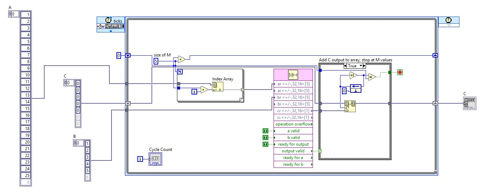

# Austin's Workspace

## V0.4.7-AD-1
* Works, just run the target. 

## V0.4.7-AD-2
* removed host. 

## V0.4.7-AD-3
* cleaned up the array slicing code 
* It works with an index array, then rebuilds an array.

## V0.4.7-AD-4
* Works with the index array
* Boolean Tags for the matrix matrix multiply are not working, just an ad hoc success. 

## V0.4.7-AD-5
* Works for a 2x2, but I made a major change to how I treat the flags, I now assume that for each clock iteration, my data is ready to go because I am not useing DMA and everythin is alway sin the array. 
* I do stop the indexing using their cycle count, but given the fact that this is pipelined, I don't think that is needed at all.

## V0.4.7-AD-6
* a [3x3]*[3x1]
* had to change it to 3 cycles for matrix, cycles/matrix

## V0.4.7-AD-7
* a [4x4]*[4x1]
* had to change it to 4 cycles for matrix, cycles/matrix
* Link to GPT chat if it helps https://chatgpt.com/share/e/6a3c3cf1-ba78-832f-9ba4-6abf94dc33d2 
<<<<<<< HEAD

## V0.4.7-AD-8
* a [5x5]*[5x1]
* had to change it to 5 cycles for matrix, cycles/matrix

## V0.4.7-AD-9
* a [5x5]*[5x1]
* deleted everything not required for it to run, some of that may have been useful. 
* Minimum working example (MWE).

 Matrix vector FPGA code that runs on the target.

